# Student Management System - ER Diagram

## Enhanced Entity Relationship Diagram

```mermaid
erDiagram
    STUDENT {
        int id PK
        text name
        text father_name
        text mother_name
        text email
        text photo
        text personal_mobile
        text father_mobile
        text mother_mobile
        text nick
        text address
        date birth_day
        text gender
        text religion
        text school
        int ssc_roll
        int ssc_reg
        text ssc_board
        double ssc_result
        datetime date
    }

    PROGRAM {
        int id PK
        text name
        date start
        date end
        text subject
        text batch
        double fee
        int type
        int monthly_fee
        int add_by FK
        datetime date
    }

    BATCH {
        int id PK
        text name
        text start
        text end
        text day
    }

    ADMIT_PROGRAM {
        int id PK
        int student_id FK
        int program_id FK
        int batch_id FK
        datetime admit_date
        int admit_by FK
    }

    SUBJECT {
        int id PK
        text sub_name
        text sub_code
    }

    EXAM {
        int id PK
        int program_id FK
        int sub_id FK
        text exam_name
        int total
        int mcq
        int written
        date exam_date
        timestamp date
        int add_by FK
    }

    EXAM_CATEGORY {
        int id PK
        text category_name
        int program_id FK
        datetime date
        int add_by FK
    }

    RESULT {
        int id PK
        int exam_id FK
        int student_id FK
        double mcq
        double written
        double total
        datetime date
        int add_by FK
        int sms
    }

    STUDENT_ATTENDENCE {
        int id PK
        int student_id FK
        int program_id FK
        int batch_id FK
        int status
        date date
    }

    PAYMENT {
        int id PK
        int student_id FK
        double paid
        date next_date
        datetime date
        int add_by FK
    }

    STUDENT_PAYMENT {
        int id PK
        int student_id FK
        int program_id FK
        int type
        int year
        int month
        int total_fee
        text note
        datetime date
        int add_by FK
    }

    USER {
        int id PK
        text uname
        text fname
        text photo
        text gender
        text email
        int phone
        text address
        varchar pass
        int permit
        int status
        int theme FK
    }

    NOTICE {
        int id PK
        text title
        text description
        datetime date
        int add_by FK
    }

    THEME {
        int id PK
        text name
        text bg_color
        text sidebar_hover
        text sidebar_list
        text sidebar_list_hover
        text font_color
        date date
        int added_by FK
    }

    SETTING {
        int id PK
        text option_name
        text option_value
    }

    SMS_LIST {
        int id PK
        text number
        text message
        int len
        datetime date
        text gateway
        text token
        int sender FK
    }

    SITE_ACTIVITY {
        int id PK
        int user_id FK
        text table_name
        text action_type
        text table_id
        text ip
        text browser
        text previous_data
        text present_data
        int login
        datetime date
    }

    CHAT {
        int id PK
        int user_id FK
        text message
        datetime date
    }

    %% Relationships
    STUDENT ||--o{ ADMIT_PROGRAM : "enrolls_in"
    PROGRAM ||--o{ ADMIT_PROGRAM : "has_students"
    BATCH ||--o{ ADMIT_PROGRAM : "contains"
    
    STUDENT ||--o{ STUDENT_ATTENDENCE : "has_attendance"
    PROGRAM ||--o{ STUDENT_ATTENDENCE : "tracks_attendance"
    BATCH ||--o{ STUDENT_ATTENDENCE : "attendance_for"
    
    STUDENT ||--o{ PAYMENT : "makes_payment"
    STUDENT ||--o{ STUDENT_PAYMENT : "pays_fee"
    PROGRAM ||--o{ STUDENT_PAYMENT : "fee_for"
    
    PROGRAM ||--o{ EXAM : "has_exams"
    SUBJECT ||--o{ EXAM : "exam_for"
    EXAM ||--o{ RESULT : "has_results"
    STUDENT ||--o{ RESULT : "takes_exam"
    
    PROGRAM ||--o{ EXAM_CATEGORY : "has_categories"
    
    USER ||--o{ NOTICE : "creates"
    USER ||--o{ CHAT : "sends_message"
    USER ||--o{ SITE_ACTIVITY : "performs_action"
    USER ||--o{ SMS_LIST : "sends_sms"
    
    THEME ||--o{ USER : "uses_theme"
    
    USER ||--o{ ADMIT_PROGRAM : "admits_student"
    USER ||--o{ EXAM : "creates_exam"
    USER ||--o{ RESULT : "enters_result"
    USER ||--o{ PAYMENT : "processes_payment"
    USER ||--o{ STUDENT_PAYMENT : "records_payment"
    USER ||--o{ EXAM_CATEGORY : "creates_category"
    USER ||--o{ THEME : "creates_theme"
```

## Detailed Entity Descriptions

### Core Entities

#### STUDENT
- **Purpose**: Stores comprehensive student information
- **Key Attributes**: Personal details, contact information, academic background
- **Relationships**: Central entity connected to most other entities

#### PROGRAM
- **Purpose**: Represents academic programs offered by the institution
- **Key Attributes**: Program details, duration, fees
- **Relationships**: Links to students, exams, payments

#### BATCH
- **Purpose**: Groups students within programs by schedule
- **Key Attributes**: Batch timing and scheduling information
- **Relationships**: Links to students and attendance

### Academic Entities

#### EXAM & RESULT
- **Purpose**: Manages examination system and student performance
- **Key Features**: MCQ and written exam support, automatic ranking
- **Relationships**: Links programs, subjects, and students

#### SUBJECT
- **Purpose**: Defines academic subjects
- **Relationships**: Links to exams and programs

#### STUDENT_ATTENDENCE
- **Purpose**: Tracks daily attendance
- **Key Features**: Date-wise attendance tracking per batch
- **Relationships**: Links students, programs, and batches

### Financial Entities

#### PAYMENT & STUDENT_PAYMENT
- **Purpose**: Manages all financial transactions
- **Key Features**: Fee tracking, payment history, due dates
- **Relationships**: Links to students and programs

### Administrative Entities

#### USER
- **Purpose**: System users with role-based access
- **Key Features**: Authentication, permissions, theming
- **Relationships**: Creator/modifier of most entities

#### NOTICE
- **Purpose**: Communication and announcements
- **Relationships**: Created by users

#### SETTING
- **Purpose**: System configuration
- **Key Features**: Flexible key-value configuration storage

### Communication Entities

#### SMS_LIST
- **Purpose**: SMS communication log
- **Key Features**: Gateway integration, message tracking

#### CHAT
- **Purpose**: Internal messaging system
- **Relationships**: Links to users

### Audit Entities

#### SITE_ACTIVITY
- **Purpose**: Complete audit trail
- **Key Features**: Tracks all user actions with before/after data
- **Relationships**: Links to users

## Database Constraints and Rules

### Primary Keys
- All entities have auto-incrementing integer primary keys
- Ensures unique identification of all records

### Foreign Key Constraints
- Referential integrity maintained through foreign keys
- Cascade rules implemented where appropriate

### Data Integrity Rules
1. **Student Enrollment**: Student must exist before program enrollment
2. **Attendance**: Cannot mark attendance for non-enrolled students
3. **Results**: Can only enter results for existing exams and enrolled students
4. **Payments**: Must be linked to valid student and program
5. **User Actions**: All actions must be linked to authenticated users

### Business Rules
1. **Unique Constraints**: Student nick names must be unique
2. **Date Validation**: Exam dates cannot be in the past
3. **Fee Validation**: Payment amounts cannot exceed program fees
4. **Attendance Rules**: One attendance record per student per day per program
5. **Result Rules**: Results cannot exceed exam total marks

This ER diagram provides a comprehensive view of the database structure supporting the Student Management System's functionality.